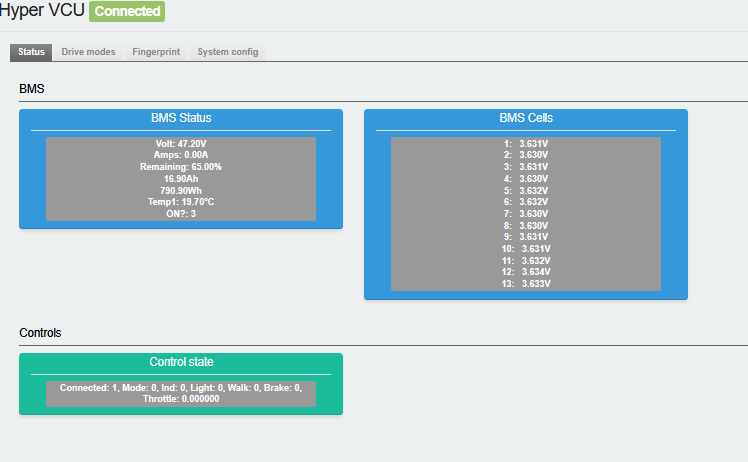
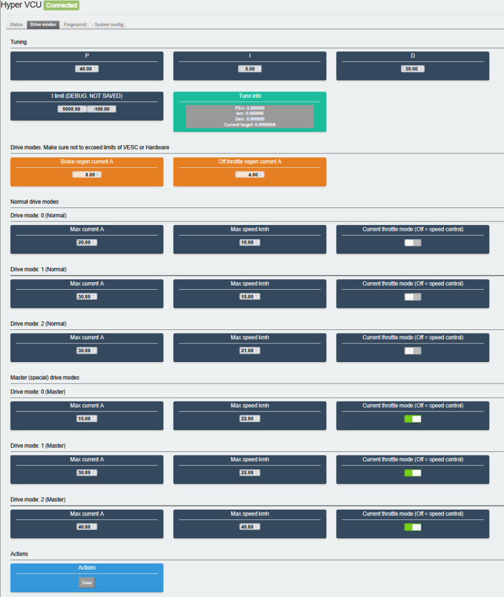
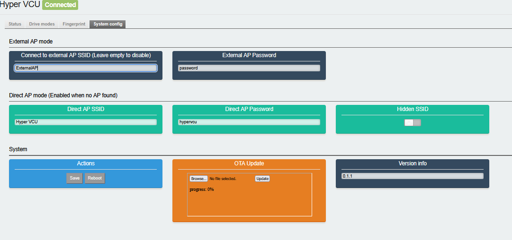

## Hyper VCU

**INFO: This project is in early development. Many features are not yet fully implemented or tuned**

### Application
DIY replacement vehicle controller for Joyor T6E scooters for use with VESC motor drivers and the original controls.
Currently only supports Joyor T6E.

### Features

* Controls all lights: Front, Rear, Brake, Indicators
* 3 Drive modes + 3 additional "master" drive modes
    * Speed, Current and control mode (Throttle vs. Speed control) for every mode selectable
* Configurable Off-throttle and Brake regen strength
* R503 Fingerprint reader support
    * Locks scooter until valid fingerprint is scanned
    * Enables secondary drive modes with "master finger"
* USB & OTA firmware update
* VESC Control via UART
* Reads charge level from original BMS via BLE
* Configuration via WiFi webinterface (ESPUI based)
    * Connects to existing AP or fallback to standalonge AP mode (Password + Hidden SSID supported)

### Connections

TODO

### Usage
TODO
#### Access webinterface in standalone AP mode
1. Connect to "Hyper VCU" wifi, default pw "hypervcu"
2. Open "http://10.13.37.1" in a browser

#### Common usage
* Enable/Disable zero start: Hold brake, push throttle up quickly to 100% and release. "!" icon should appear
* Zero start and master modes reset to startup behaviour when enabling drive mode 0

TODO:::

#### With fingerprint reader
* Unlock motor: Scan any valid finger
* Enter "master modes": Scan finger with id <10
* Exit "master modes": Scan any non master finger

#### Without fingerprint reader
* Unlock motor: Unlocked on start
* Enter "master modes":
    1.  Enter pedestian mode (Hold drive mode "down" in any non zero drive mode)
    2.  Hold brake and exit pedestrian mode (push throttle up for example)

### Display + Errors

#### Display indicators
Display | Meaning
----|---
bt n "P menu" | Motor temperature
"!" Symbol | Zerostart or Master mode active
Battery % | Battery %
Speed | Speed kmh

#### Error codes
Errors are bit masked. Multiple can appear at once.
Name | Code
----|---
VCUERR_LOCKED (Fingerprint locked) | 0x01
VCUERR_VESCNOK (Vesc error/Disconnected) | 0x10
VCUERR_VESCTEMP (Motor or mosfet hot) | 0x20

### Screenshots

### T6E Protocol
From Controller to Display
Byte|IDLE| Info | Note
-|-|-|-
0|0x02|start| 
1|0x14|start2?| 
2|0x03|start3?| 
3|0x00| | 
4|0x00|0x20  “!” symbol|
5|0x80|Brake|Brake 0xA0
6|0x00||
7|0x00||
8|0x00|speed high|
9|0x00|speed low in 0.1kmh|0-99kmh
10|0x00|Battery in %|
11|0x00||
12|0x1E ||
13|0x00|errors|
14|0x00||
15|0x00||
16|0x00||
17|0x00||
18|0x00|Blinker pins|0x1 left, 0x2 right
19||CRC|

From Display to Controller (5V)

Byte|IDLE| Info | Note
-|-|-|-
0|0x01||
1|0x14||
2|0x03||
3|0x00||
4|0x00|Speed mode 0|Mode 1 = 5, Mode 2 = 10, Mode 3 = 15
5|C0|Flags|Walk 225, Headlight 224
6|0x00||
7|0x00||
8|0x00||
9|0x00||
10|0x00||
11|0x00||
12|0x14||
13|0x1E||
14|0x00||
15|0x00||
16|0x00||
17|0x00|throttle|
18|0x00|throttle|Maxval 1000
19|0x00|Blinker/Pin status|0x1 left, 0x2 right
20||CRC|
